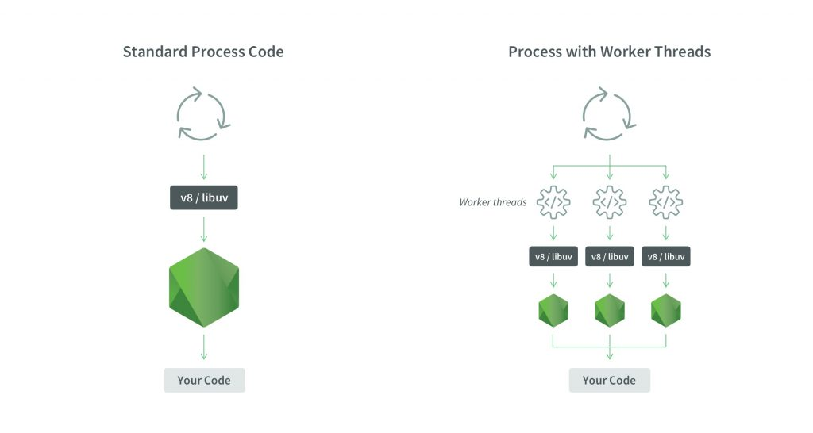
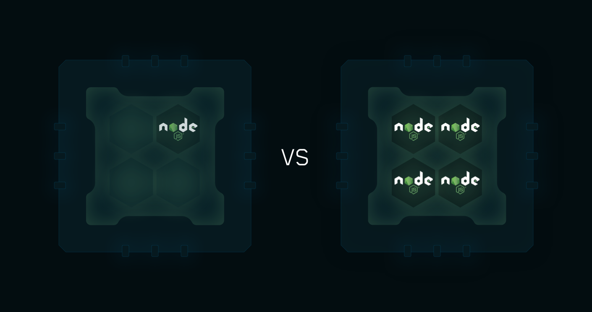
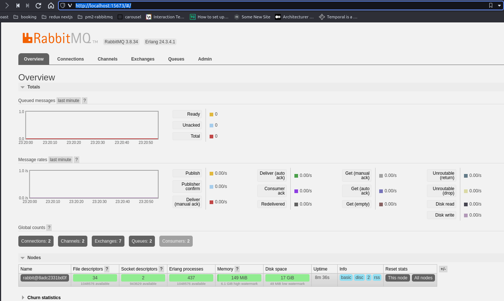

# Cluster nodejs typescript 
### PM2, Node, RabbitMQ and Redis 

# Start project

- Building an image\
``
$ docker-compose build
``

- Running containers\
``
$ docker-compose up
``

- Running pm2 monitor\
``
$ docker exec -it nodejs-container sh
``\
``
$ yarn pm2:monit
``

``
 http://localhost:3000/api/fibonacci?value=18
``

- See the App logs\
``
$ cat /tmp/app.log
``\
``
$ cat /tmp/worker-1.log
``\
``
$ cat /tmp/worker-2.log
``


## Standard process vs Process with worker threads
We can think of running our application in a cluster.\
When we run our application in a cluster, we will create a number of processes based on our requirement.
Each process can run in a separate court.

And all these processes will share the same part of our application.\
This way, we can distribute the load of our application to the number of processes.
Each process has its own memory with their own V8 engine.



# Stress NodeJs Cluster Test
## Loadtest
While using loadtest, we can use number of parameters like:
- -n : sets max number of requests
- -c : concurrent requests
- --rps : number of requests per second
```
$ docker exec -it nodejs-container sh
$ yarn loadtest -n 1000 -c 100 --rps 200 http://localhost:3000/api/fibonacci?value=10
```

# PM2
Is a production process manager for NodeJs applications with a build-in load-balancer.



```
yarn pm2:start
yarn pm2:monit
```

# RabbitMQ 
I used the default configuration used by the official RabbitMQ docker image 'rabbitmq:3.8-management-alpine'.\
You can change RabbitMQ connection information in docker-compose.yml.

To check if our RabbitMQ is working well, it is best to click http://localhost:15673 on the browser. We should see a long screen like below:


